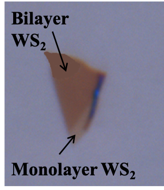

# 自动生成GFM目录

<!--ts-->
   * [自动生成GFM目录](#自动生成gfm目录)
      * [参考文献](#参考文献)
      * [引言](#引言)
      * [使用方法](#使用方法)
         * [对于本地文档](#对于本地文档)
         * [对于远程文档](#对于远程文档)
         * [对于多个文档](#对于多个文档)
         * [本地与远程结合](#本地与远程结合)
         * [自动插入和更新目录](#自动插入和更新目录)
         * [输出目录文件](#输出目录文件)
      * [工作流程](#工作流程)
         * [目前工作流程注意事项及问题](#目前工作流程注意事项及问题)

<!-- Added by: xiejiahao, at:  -->

<!--te-->

## 参考文献
https://github.com/ekalinin/github-markdown-toc

## 引言

GFM即`github flavoured markdown`，是不支持自动生成目录的。


经过努力，实现了自动生成目录的方法。


在本仓库中有名为`gh-md-toc`的文件，在同步到本地后使用
```
chmod a+x gh-md-toc
```
改变其权限*虽然不知道有什么用*。

## 使用方法
### 对于本地文档
在写好`.md` 文件后，执行类似于下面的命令。
```bash
➥ ./gh-md-toc ~/projects/Dockerfile.vim/README.md                                                                                                                                               

Table of Contents
=================

  * [Dockerfile.vim](#dockerfilevim)
  * [Screenshot](#screenshot)
  * [Installation](#installation)
        * [OR using Pathogen:](#or-using-pathogen)
        * [OR using Vundle:](#or-using-vundle)
  * [License](#license)
```

生成的即为目录内容，需要将目录内容粘贴至文档中需要生成目录的位置。

### 对于远程文档
```bash
➥ ./gh-md-toc https://github.com/ekalinin/envirius/blob/master/README.md

Table of Contents
=================

  * [envirius](#envirius)
    * [Idea](#idea)
    * [Features](#features)
  * [Installation](#installation)
  * [Uninstallation](#uninstallation)
  * [Available plugins](#available-plugins)
  * [Usage](#usage)
    * [Check available plugins](#check-available-plugins)
    * [Check available versions for each plugin](#check-available-versions-for-each-plugin)
    * [Create an environment](#create-an-environment)
    * [Activate/deactivate environment](#activatedeactivate-environment)
      * [Activating in a new shell](#activating-in-a-new-shell)
      * [Activating in the same shell](#activating-in-the-same-shell)
    * [Get list of environments](#get-list-of-environments)
    * [Get current activated environment](#get-current-activated-environment)
    * [Do something in environment without enabling it](#do-something-in-environment-without-enabling-it)
    * [Get help](#get-help)
    * [Get help for a command](#get-help-for-a-command)
  * [How to add a plugin?](#how-to-add-a-plugin)
    * [Mandatory elements](#mandatory-elements)
      * [plug_list_versions](#plug_list_versions)
      * [plug_url_for_download](#plug_url_for_download)
      * [plug_build](#plug_build)
    * [Optional elements](#optional-elements)
      * [Variables](#variables)
      * [Functions](#functions)
    * [Examples](#examples)
  * [Example of the usage](#example-of-the-usage)
  * [Dependencies](#dependencies)
  * [Supported OS](#supported-os)
  * [Tests](#tests)
  * [Version History](#version-history)
  * [License](#license)
  * [README in another language](#readme-in-another-language)
```

### 对于多个文档

```bash
➥ ./gh-md-toc \
    https://github.com/aminb/rust-for-c/blob/master/hello_world/README.md \
    https://github.com/aminb/rust-for-c/blob/master/control_flow/README.md \
    https://github.com/aminb/rust-for-c/blob/master/primitive_types_and_operators/README.md \
    https://github.com/aminb/rust-for-c/blob/master/unique_pointers/README.md

  * [Hello world](https://github.com/aminb/rust-for-c/blob/master/hello_world/README.md#hello-world)

  * [Control Flow](https://github.com/aminb/rust-for-c/blob/master/control_flow/README.md#control-flow)
    * [If](https://github.com/aminb/rust-for-c/blob/master/control_flow/README.md#if)
    * [Loops](https://github.com/aminb/rust-for-c/blob/master/control_flow/README.md#loops)
    * [For loops](https://github.com/aminb/rust-for-c/blob/master/control_flow/README.md#for-loops)
    * [Switch/Match](https://github.com/aminb/rust-for-c/blob/master/control_flow/README.md#switchmatch)
    * [Method call](https://github.com/aminb/rust-for-c/blob/master/control_flow/README.md#method-call)

  * [Primitive Types and Operators](https://github.com/aminb/rust-for-c/blob/master/primitive_types_and_operators/README.md#primitive-types-and-operators)

  * [Unique Pointers](https://github.com/aminb/rust-for-c/blob/master/unique_pointers/README.md#unique-pointers)
```
### 本地与远程结合
```bash
➥ ./gh-md-toc \
    ~/projects/Dockerfile.vim/README.md \
    https://github.com/ekalinin/sitemap.s/blob/master/README.md

  * [Dockerfile.vim](~/projects/Dockerfile.vim/README.md#dockerfilevim)
  * [Screenshot](~/projects/Dockerfile.vim/README.md#screenshot)
  * [Installation](~/projects/Dockerfile.vim/README.md#installation)
        * [OR using Pathogen:](~/projects/Dockerfile.vim/README.md#or-using-pathogen)
        * [OR using Vundle:](~/projects/Dockerfile.vim/README.md#or-using-vundle)
  * [License](~/projects/Dockerfile.vim/README.md#license)

  * [sitemap.js](https://github.com/ekalinin/sitemap.js/blob/master/README.md#sitemapjs)
    * [Installation](https://github.com/ekalinin/sitemap.js/blob/master/README.md#installation)
    * [Usage](https://github.com/ekalinin/sitemap.js/blob/master/README.md#usage)
    * [License](https://github.com/ekalinin/sitemap.js/blob/master/README.md#license)

Created by [gh-md-toc](https://github.com/ekalinin/github-markdown-toc)
```

### 自动插入和更新目录

首先在文档中希望插入目录的地方插入以下两行：
```
<!--ts-->
<!--te-->
```
运行以下命令，便会在文档中自动插入目录：
```bash
$ ./gh-md-toc --insert README.test.md

Table of Contents
=================

   * [gh-md-toc](#gh-md-toc)
   * [Installation](#installation)
   * [Usage](#usage)
      * [STDIN](#stdin)
      * [Local files](#local-files)
      * [Remote files](#remote-files)
      * [Multiple files](#multiple-files)
      * [Combo](#combo)
   * [Tests](#tests)
   * [Dependency](#dependency)

!! TOC was added into: 'README.test.md'
!! Origin version of the file: 'README.test.md.orig.2018-02-04_192655'
!! TOC added into a separate file: 'README.test.md.toc.2018-02-04_192655'


Created by [gh-md-toc](https://github.com/ekalinin/github-markdown-toc)
```


当文档更新后，运行`./gh-md-toc --insert ...`，目录便会自动更新。


注意到上面的命令执行完有
```
!! TOC was added into: 'README.test.md'
!! Origin version of the file: 'README.test.md.orig.2018-02-04_192655'
!! TOC added into a separate file: 'README.test.md.toc.2018-02-04_192655'
```
即程序生成了两个文件来存放源文件备份和生成的toc，这样很糟糕，所以我改动了源代码使得这两个文件被自动删除了。

于是现在的输出是这样的：
```
!! TOC was added into: '生成GFM目录.md'
!! Origin version of the file: '生成GFM目录.md.orig.2018-10-07_141040'
!! TOC added into a separate file: '生成GFM目录.md.toc.2018-10-07_141040'
And they have been removed, hahahahahahahahaha
```
### 输出目录文件

`./gh-md-toc https://github.com/ekalinin/envirius/blob/master/README.md > table-of-contents.md`
在命令的最后加上`> filename.md`即可输出文件目录到指定文件。

## 工作流程

### 此次级目录下内容为第一版工作流程，现在工作流程已经发生变化，见下一次级目录

经过上述学习，***gh-md-toc*** 主要有如下实用功能：


1. `./gh-md-toc filename.md`直接在命令行中显示文件目录，并且可以同时显示多个文件目录。
2. 首先在文件中插入：
   ```
   <!--ts-->
   <!--te-->
   ```
   之后执行`./gh-md-toc --insert filename.md`可直接在文件中插入目录，或者更新目录。
3. `./gh-md-toc filename.md > filename2.md`可将目录导入到`filename2.md`文件中。


我们想实现：

1. 在每个文件中都包含目录：

    所以在写每个文档时都应加入

   ```markdown
   <!--ts-->
   <!--te-->
   ```

    在完成后执行插入目录命令`./gh-md-toc --insert filename.md`。

2. 在`README.md`中实现总的目录：
   
   在文件夹中执行`./gh-md-toc *.md > README.md`即可。

所以在写完某文档或修改某文档结构后要执行两个命令：

```bash
./gh-md-toc --insert filename.md
./gh-md-toc *.md > README.md
```

这样就保证了文档中的目录和总的目录都得到了更新。

### 第二版工作流程

现在README文件需要手动维护，只加文章标题进去。

操作其实很简单，看一下README源码就懂。

latex的解决方案暂时直接在源码里写latex，网站上的编译先通过自己安装插件实现，以后可能会搬到有latex编译的网站上，或者自己做一个。

$E = mc^2$

图片的解决方案：
将图片粘贴到`media`文件夹下，用以下方式引用：




