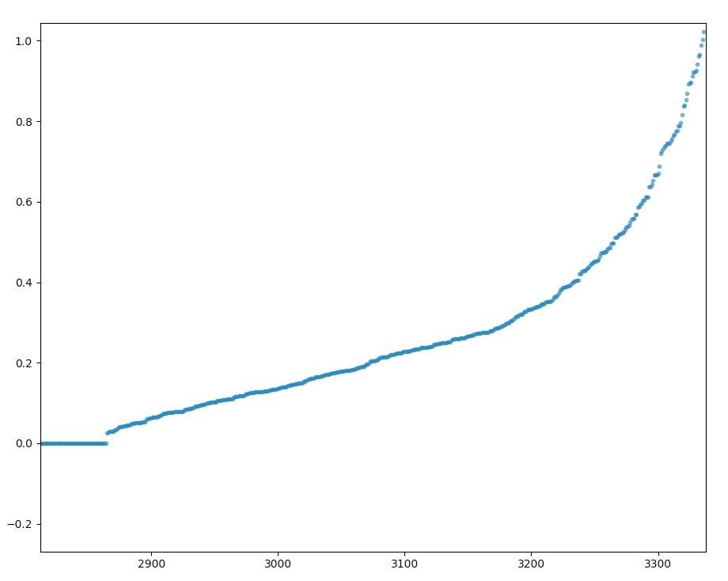

# ***BCMmodule*** 使用指南 v 0.1.0

***BCMmodule*** python模块由几个简单的python程序组成，能够基本实现在大量结构中去除相似结构，筛选出少量不同结构的目的。

[TOC]

## 1    结构表征与筛选方法

人们通常使用的结构表示方法为在笛卡尔坐标系中以原子坐标的形式描述原子的位置。这种最为常用的方法虽然可以准确的描述结构，但随坐标系选择和原子排序方式的不同有无数种表示形式，所以无法真正用于材料结构之间的对比和分类。

各类结构表征方法就是指与常用的在笛卡尔坐标系中表示原子位置的方法不同的结构表示方法，表征结果往往具有可以计算对比结构之间差别的特点。

### 1.1 BCM方法

BCM(Bond-Orientation-Matrix)方法是一种基于BOO(Bond-Orientation-Order)方法的结构表征方法，可以提取结构中原子间连线的角度信息，并且能将元素种类数相同的结构表示为维数相同的矩阵，从而实现对比不同结构的目的。

### 1.2 分层聚类

分层聚类是聚类算法的一种，通过计算不同类别的相似度创建一个有层次的嵌套的树。假设有 n 个待聚类的样本，对于层次聚类算法，它的步骤是：

* 步骤一：（初始化）将每个样本都视为一个聚类
* 步骤二：计算各个聚类之间的相似度
* 步骤三：寻找最近的两个聚类，将他们归为一类
* 步骤四：重复步骤二，步骤三；直到所有样本归为一类

所以在分层聚类中有以下特征：

* 聚类是分步进行的
* 起始类数即输入的样本数量`n`
* 每一步聚类将两类聚为一类，使得总类数减少`1`
* 聚类总共进行`n-1`步，使得所有样本聚为一类
* 在完成第`m`步聚类后，剩余类数目为`n-m`

### 1.3 结构筛选的实现

利用BCM结构表征方法，用分层聚类处理结果实现结构筛选的流程如下：

* 批量计算大量结构的BCM矩阵。
* 对于大量的表征结果，用分层聚类的方法完成整个聚类过程。
* 对聚类结果进行处理和分析，作出聚类距离变化图。使用者可以根据分析图像或者自身需求自主决定聚类步数，将大量结构聚类为自主决定数量的类。
* 从这些获得的类中选取每类的代表结构，实现从大量结构中去除相似结构的方法筛选出少量不同结构的目的。

## 2    环境配置及编译

### 2.1 Fortran程序的python包装

本程序的基础为计算BCM的Fortran程序。python中`NumPy`模块中的`f2py`程序可以将Fortran程序包装生成python模块。在本例中BCM计算Fortran程序为`BCMfunc.f90`,`car2sphe.f90`,`spherical.f90`三个文件，我们利用`f2py`程序将其编译包装成名为`fbcm.so`python库文件。

### 2.2 版本问题

在程序使用时涉及到环境版本兼容问题：

* `f2py`生成的为`.so`文件，为动态库文件，此类文件的调用时也需要调用C和Fortran编译器，所以调用`.so`文件时编译器版本需和生成`.so`文件编译器版本兼容。

* 而且生成python模块接口的`f2py`程序属于`NumPy`模块的一部分，所以调用生成的python模块时的`NumPy`版本也需要和生成python模块的`NumPy`版本兼容。

所以涉及到编译环境和python环境在生成模块和使用模块时的匹配问题，所以建议在使用前在使用环境中使用`f2py`生成`fbcm.so`文件。生成命令见下一节编译部分。

### 2.3 环境配置及编译

由于利用`f2py`转换Fortran程序时涉及到Fortran代码编译，且`f2py`属于`NumPy`模块，所以在使用`f2py`生成python模块时需要完备的C和Fortran编译环境和完备的python环境。

* 经过测试，宝德和五洲集群上的编译环境均良好。
* 宝德和五洲集群上经过测试可用的公用python环境分别为：
    * 宝德：`/share/apps/pylada/bin/python`
    * 五洲：`/opt/intel/software/python2.7/bin/python`

其它python2.7版本应该也可以完成`fbcm.so`的生成操作。

在配置好环境后在`BCM/`文件夹下执行下面的命令：

```
f2py -c -m fbcm BCMfunc.f90 car2sphe.f90 spherical.f90
```

命令执行结束后若在文件夹中生成了`fbcm.so`文件则说明编译成功了。就可以开始使用程序了。

## 3    使用程序3步完成结构筛选

在配置好编译环境和python环境，使用`f2py`生成了`fbcm.so`文件后，程序就可以运行了。使用程序完成结构筛选工作需要进行以下三个步骤：

### 3.1 BCM批量计算并聚类分析

>**由于本步骤涉及到BCM计算，即涉及到调用`fbcm.so`文件，所以应在生成`fbcm.so`文件相同环境下执行。**

此步进行的计算为，计算所有结构的BCM矩阵并完成整个层次聚类，将聚类信息保存下来。

首先打开`calculate&cluster.py`文件，其内容如下：

```python
from bcmanalys import __cluster

folderpath = 'your structer files storage folderpath'

__cluster(folderpath)

```
将其中`folderpath`变量改为需要计算的所有结构存储文件夹的绝对路径。程序会计算路径文件夹下所有结构文件，可以存在非结构文件。

修改完毕后在命令行中执行：

```
python calculate&cluster.py
```

执行过程中会输出正在计算的文件路径，执行结束后会生成三个文件：

* `name.txt`：储存了所有计算的文件名列表
* `cluster.txt`：储存了聚类的结果
* `cluster_result.npy`：二进制格式储存了聚类的结果，便于后续使用

### 3.2 根据聚类分析图像确定聚类代数

由于在分层聚类中有以下特征：

* 聚类是分步进行的
* 起始类数即输入的样本数量`n`
* 每一步聚类将两类聚为一类，使得总类数减少`1`
* 聚类总共进行`n-1`步，使得所有样本聚为一类
* 在完成第`m`步聚类后，剩余类数目为`n-m`

所以我们想达到将大量结构聚类为一定数量的类的目的，需要确定一个聚类的步数`m`，最后得到`n-m`个类。

确定`m`的值可以由最后需求筛选得到多少种结构决定。假如我们想从总共`n`个结构中筛选得到`l`个结构，那么我们确定的聚类步数就为`m = n - l`.

如果我们想达到从大量结构中筛选出少数不重复结构且尽量少丢失结构多样性目的，选择的聚类步数也需要在一定的合理范围内。若选择的步数太大，剩余类数很少，则会丢失许多并不相似的结构。选择步数很小时剩余结构过多达不到筛选结构的目的。

为了使得我们选择的聚类步数在合理范围内，需要对聚类的结果进行分析，本程序提供了两种图像的绘制功能，分别是***聚类过程树状图***，和***聚类距离变化趋势图***。

#### 3.2.1 绘制图像

>**绘图函数并不直接保存图像，而是弹出`matplotlib`模块自带的查看器并在其中显示图像。这样做的原因是在分析大量结构的聚类结果时保存整个树状图或聚类距离变化趋势图的意义不大，需要在其自带查看器中进行局部放大分析。所以绘图操作的执行需要在一个GUI环境中进行，也就是无法在集群上进行。但这一步操作并不会调用`fbcm.so`文件，只需要具有`NumPy`模块和`matplotlib`模块的python环境即可。**

上一步操作执行完毕后生成了聚类的结果信息，我们需要对聚类结果进行分析。在`ploy_cluster.py`文件内提供了两个聚类结果分析绘图函数，其内容如下：

```python
# coding: utf-8

from clusteranalys import plotcluster
from clusteranalys import plotgen_d

#plotcluster() #聚类树状图，若需要聚类树状图需去掉本行开头注释
plotgen_d()    #聚类距离变化趋势图

```
想要得到哪种图像就执行对应的生成函数，默认第一个函数是注释掉的，即不执行的。若想要绘制聚类树状图需要去掉其生成函数前的注释，并将第二个函数前加入注释。若同时绘制两种图像需要将第一幅图像关闭后才能查看第二幅图像。

执行`python plot_cluster.py`即可生成图片。

#### 3.2.2 分析图像

**聚类过程树状图** 形式如下：


图像可以展示所有的类是如何一步步聚在一起的，但对于本工作其参考价值不大。
可以看到大量结构的聚类过程树状图中最初的聚类步骤会很密集，我们将最底部放大：


注意两幅图片纵坐标尺度的变化，说明聚类开始时的类之间距离与后面过程有着数个数量级的差距。

为了更好的分析聚类距离随步数的变化过程，我们需要做 **聚类距离变化趋势图** ：


此图像反应随着聚类步数的增加，每一步聚集在一起的两类之间的距离的变化趋势。

上图所反应的主要内容为在大约前2800步聚类过程中，每一步聚在一起的两类之间的距离都接近于零且没有明显增长，说明前期聚在一起的类中的结构相似度很高。而在2800～2900步之间聚类距离开始增长，而且似乎有一个距离突变增加的过程。我们将局部的图像放大：


发现确实有一个距离突变增加的现象。说明在此步之后聚集在一起的类之间的结构相似程度比此步之前有明显减小，所以这一步所对应的步数是一个潜在合理的聚类结果步数。

若还要继续选择其它结果，可以将结果曲线中曲率较大的部分放大：



分析上图的结论为，若选择3200代以后的聚类程度，损失的结构种类会比较多。因为总体上来说3200代以后每次聚类的两类之间的距离不仅较大，且增大速度也很快，所以若选3200代之后的代数，每增加一代，其合并的类不相似的程度就增大很多。

#### 3.2.3 确定聚类步数

结合分析图像和自身需求，最后确定聚类的步数。

* 若自主决定最后剩余结构数量为`l`,那么聚类的步数应为`n-l`,`n`为结构的总数。可以打开文件`name.txt`查看文件的总行数确定`n`的值。

    > 若共有3000个结构，希望筛选得到300个结构，那么聚类步数就选为3000-300=2700步

* 若从聚类距离分析图某点根据其确定代数，可以打开`cluster.txt`详细确定其位置。

    `cluster.txt`文件中每一行代表一步聚类的过程，其包含的信息有如下含义：
    ```
    (合并的类标号1，合并的类标号2，合并的两类之间距离，合并后类中元素个数）
    ```
    所以用于确定聚类步数的为第三列距离信息，每一行的行号即为聚类的步数。

    >对于上图中存在距离突变的聚类步数，我们在其对应的`cluster.txt`文件中可找到其详细为第2865步聚类后之后的聚类距离发生了突变，据此我们可以选择聚类步数为2865步。
    >

### 3.3 确定聚类结果并生成代表结构

>**由于本步骤涉及到BCM计算，即涉及到调用`fbcm.so`文件，所以应在生成`fbcm.so`文件相同环境下执行。**

确定了聚类的步数后，就可以生成最后的聚类结果。即所有结果聚类为指定数量的类，以及每类中有哪些结构。

之后需要进行提取每类的代表结构：对于一个类，我们计算其中每个结构与其它所有同一类中结构的距离并求和，我们取与同类结构距离之和最小的结构来代表这个类。

执行这两个操作的函数在文件`get_result.py`中。打开文件`get_result.py`，其内容如下：

```python
from clusteranalys import __genget
from bcmanalys import __reprecluster

num = 'decided generation number'
__genget(num)
__reprecluster()
```

将`num`的值改为自己确定的聚类步数，然后保存文件。

在命令行中执行：

```
python get_result.py
```

执行结束后会生成`clusterlist.txt`,`represent_cluster.txt`两个文件：

* `clusterlist.txt`储存了最后的聚类结果。即所有结果聚类为指定数量的类，以及每类中有哪些结构。
* `represent_cluster.txt`中即是提取了每类中的代表结构的列表，也就是整个结构筛选的最终结果列表。其形式是每行为选出的结构文件的绝对路径。

## 4    使用流程总结

由于第二步绘制聚类结果分析图的过程需要GUI环境，即需要在本地的Linux系统中进行，所以整个使用流程需要在两个不同的环境下进行。整个使用流程总结如下：

1. 在 **集群上** `BCM/`文件夹下执行：

    ```
    f2py -c -m fbcm BCMfunc.f90 car2sphe.f90 spherical.f90
    ```
    命令编译生成`fbcm.so`文件。

2. 修改`calculate&cluster.py`文件，将其中`folderpath`变量改为需要计算的结构储存文件夹绝对路径。然后在 **集群上** `BCM/`文件夹下执行：
    ```
   python calculate&cluster.py
    ```

3. 计算结束后将`BCM/`文件夹拷贝到 **本地Linux** 系统，在其中执行：
    ```
    python plot_cluster.py
    ```
    默认只生成*聚类距离变化趋势图*

4. 根据分析图像或自主需求确定聚类步数，在 **集群上** `BCM/`文件夹下修改`get_result.py`中`num`变量为最终确定的聚类步数并保存，然后执行：
    ```
    python get_result.py
    ```
    得到最终结果列表`represent_cluster.txt`