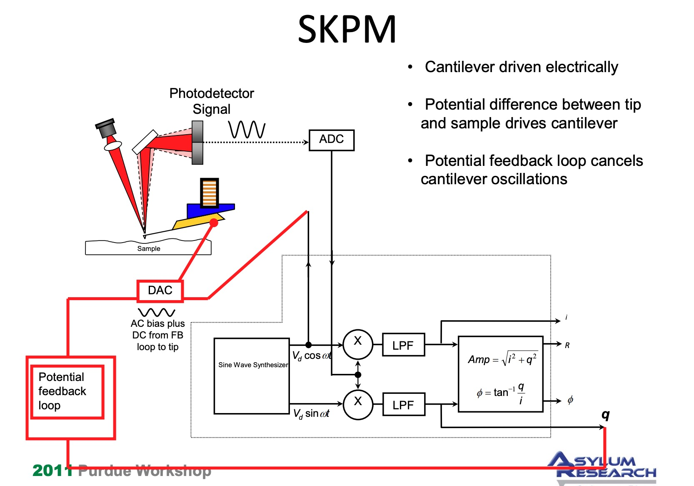

# PFM和SKPFM学习

## 参考文献

<https://www.parksystems.com/index.php/park-spm-modes/93-dielectric-piezoelectric/230-piezoelectric-force-microscopy-pfm>

<https://en.wikipedia.org/wiki/Piezoresponse_force_microscopy>

## PFM

* Full name: Piezoresponse force microscopy
* piezo: 压电的
* piezoresponse: 压电响应
* PFM: 压电显微镜

PFM是一种基于AFM的显微技术，是一种接触式AFM，但其探针可导电并在探测时施加电压。

PFM的对比机制和铁电畴图案的检测基于铁电材料必然是压电的事实。基本上，悬臂执行三种位移：（i）由于d 33 eff导致的平面外力引起的垂直偏转系数，（ii）扭转（由剪切压电效应引起的d 15 eff），和（iii）当面内力沿悬臂轴作用时，与表面相互作用的屈曲。第一类变形称为平面外（或垂直PFM或VPFM）测量。

如果极化和施加的电场是平行的，则变形为正（膨胀），压电响应信号与V AC同相。相反，如果施加的电场反平行于自发极化，这将导致压电收缩，从而降低悬臂的下降（图2b）。电场和压电响应信号的相位偏移180°。类似地，面内极化铁电晶粒的极化方向可以通过相关的（剪切）压电系数d 15 eff推导出来。（图2c，d）。在这种情况下，施加的电场引起晶粒的剪切变形，其通过摩擦力传递到悬臂的扭转运动。这些测量将进一步表示为面内（或横向PFM或LPFM）测量

## SKPFM或SKPM

* Full name: Scanning Kelvin Probe (Force) Microscopy
* 非接触式
* 测量表面电势

