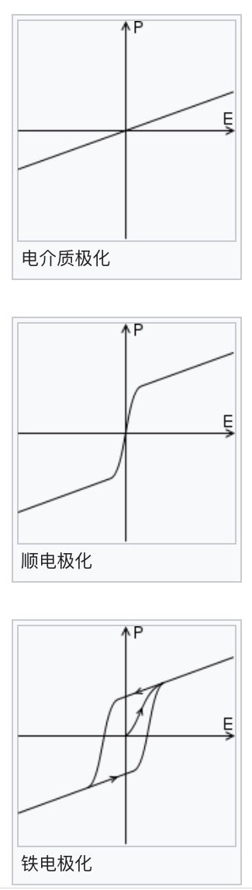
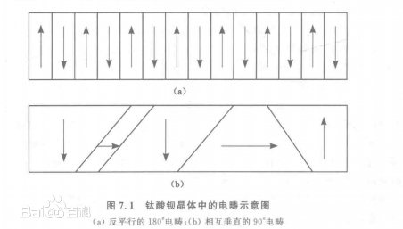
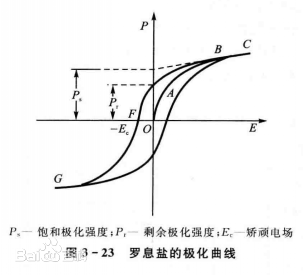

# 铁电性复习

<!--ts-->

   * [铁电性复习](#铁电性复习)
      * [参考文献](#参考文献)
      * [电偶极矩](#电偶极矩)
      * [电介质](#电介质)
      * [电极化强度](#电极化强度)
      * [电极化强度与电介质中的静电场](#电极化强度与电介质中的静电场)
      * [铁电性](#铁电性)

<!-- Added by: xiejiahao, at:  -->

<!--te-->

## 参考文献

* 《普通物理学》——程守洙，江之永
* 《新概念物理——电磁学》——赵凯华，陈熙谋
* [关于真空电容率的维基百科](https://zh.wikipedia.org/wiki/%E7%9C%9F%E7%A9%BA%E7%94%B5%E5%AE%B9%E7%8E%87)
* [铁电畴百度百科](https://baike.baidu.com/item/%E9%93%81%E7%94%B5%E7%95%B4/9052491)
* [电畴百度百科](https://baike.baidu.com/item/%E7%94%B5%E7%95%B4)

## 电偶极矩

* 电偶极子：两个大小相等符号相反的点电荷+q和-q，它们分开距离l，这一电荷系统成为*电偶极子*
* 电偶极矩：取从负电荷指向正电荷的矢量$l$的方向作为正方向，电荷量q与矢量$l$的乘积定义为电偶极矩

$$
p = ql
$$

## 电介质

* 电介质是电阻率很大，导电能力很差的物质。
  * 电介质的原子或分子中的电子与原子核的结合力很强，电子处于束缚状态，内部能做宏观运动的电子极少，可以看作理想的绝缘体。

* 电介质的极化：电介质处于电场中时，其原子中的电子或分子中的离子或晶体点阵中的带电粒子在电场作用下会在原子大小的范围内移动，平衡时在电介质表面会出现极化电荷。
  * 与静电感应的对比：静电感应是指导体在电场中发生的电荷的重新排列，使表面带电。静电感应可以视为一种彻底的极化，而电介质的极化则是一种微弱的静电感应。

* 电介质极化的种类：
  * 无极分子电介质的位移极化
  * 有极分子电介质的取向极化

## 电极化强度

* 电极化强度定义：当存在外电场时，由于极化的产生，电介质内体积元$\Delta V$中所有分子的电偶极矩矢量和$\sum p$不等于零。外电场越强，极化程度越大，$\sum p$也越大。因此取单位体积内分子电偶极矩矢量和作为量度电介质极化程度的物理量，即电极化强度：

$$
P = \frac{\sum p}{\Delta V}
$$

## 电极化强度与电介质中的静电场

* 在电介质中，电场强度等于外场强度减去极化电场强度。

* 一般来说，对于大多数常见的电介质，电极化强度$P$与介质内部的合场强$E$成正比,且两者方向相同：
  $$
  P=\chi_e\varepsilon_0E
  $$
  $\chi_e$为电极化率，单位为1.

## 铁电性

* 多数材料的极化是与外加电场成线性正比的，非线性效应是不显著的。这种极化叫做介电极化。
* 有些称作顺电体的材料，其线性之极化效应更加显著。于是与极化曲线斜率相对应的介电常数为一个外加电场之函数。
* ***除了非线性效应外，铁电材料中还存在自发极化。***
* 铁电材料的不同之处在于它的自发极化可以在外加电场作用下被反转，产生一个电滞曲线。

上图中当电场E为零时，极化强度有两个相反的不为零的值，这个现象就是铁电性的自发极化和自发极化的反转。

## 铁电畴(electric domain)

铁电畴指的是铁电体中自发极化方向相同的区域。铁电体中自发极化方向相同的微小区域。凡呈现自发极化，并且自发极化的方向能随外电场方向改变的晶体介质，简称为铁电体。

电畴的存在，也就是小的自发极化区域的存在是铁电体出现电滞回线的原因。

### 电滞回线产生过程

铁电体在外电场的作用下，电畴趋向与外电场方向一致，称为“畴”转向。畴转向是通过新畴的出现、发展和畴壁移动来实现的。外加电场撤去后，小部分电畴偏离极化方向，恢复原位，大部分停留在新转向的极化方向上，导致产生剩余极化。具体过程如图2所示：

* ①设单晶体的极化强度方向只有沿某轴的正向或负向两种可能。在没有外电场时，晶体总电矩为零(能量最低)。加上外电场后，沿电场方向的电畴扩展、变大，而与电场方向反向的电畴变小。这样极化强度随外电场增加而增加。

* ②电场强度继续增大，电畴方向趋于电场方向，形成一个单畴，极化强度达到饱和。

* ③**如再增加电场，则极化强度P与电场E成线性增加，沿线性外推至E=0处，相应的Ps值称为饱和极化强度，也就是自发极化强度。**

* ④若电场强度自C处下降，晶体极化强度亦随之减小。在E=0时，仍存在极化强度，就是剩余极化强度PR。

* ⑤当反向电场强度为Ec时(图1中F点处)，剩余极化强度PR全部消失。

* ⑥反向电场继续增大，极化强度才开始反向，直到反向极化达到饱和到图2中的G处，Ec称为矫顽电场强度。

## 压电效应

* 机械变形导致极化

* 电致伸缩：压电现象的逆现象，晶体在带电时或在电场中，晶体的大小将会伸长或缩短。

现在人们认为，铁电材料一定具有压电性质及其逆性质。